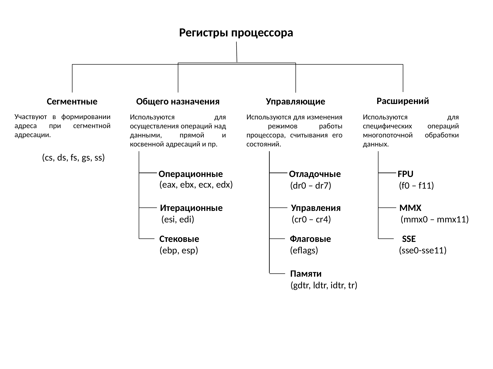
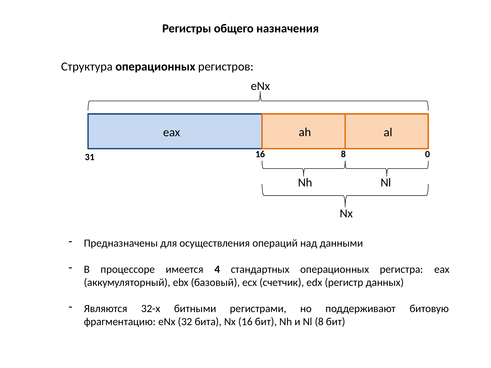
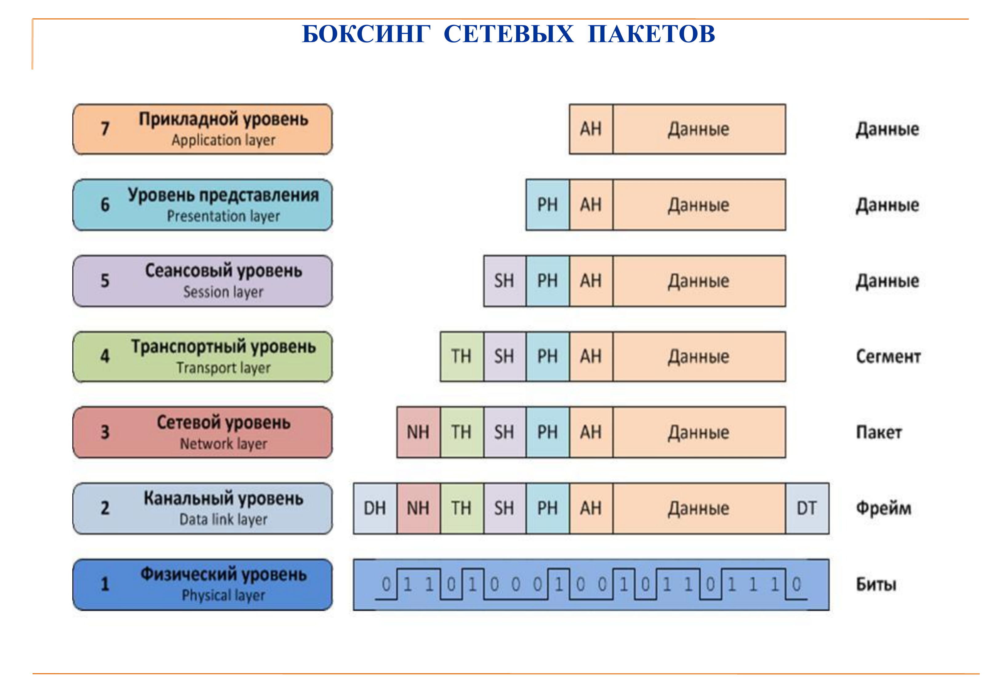
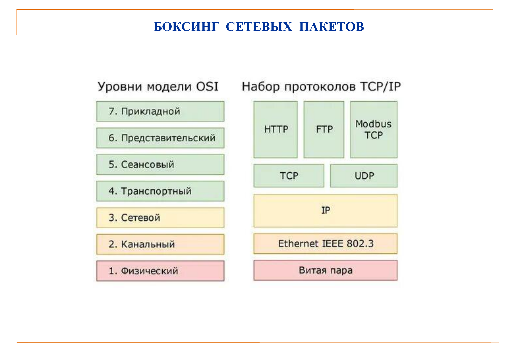
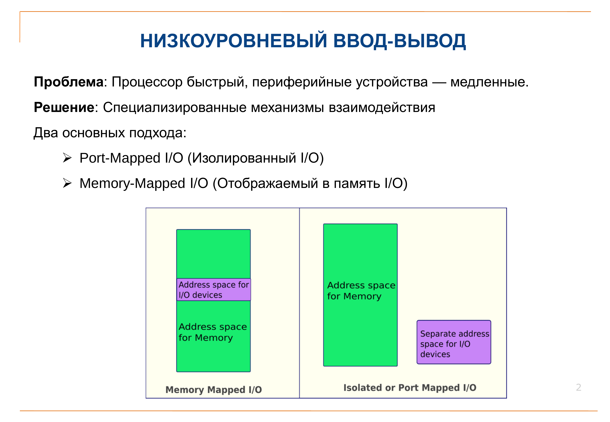
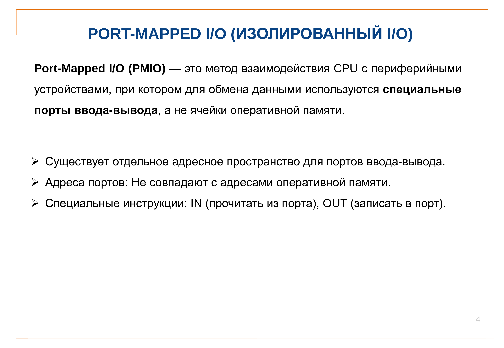
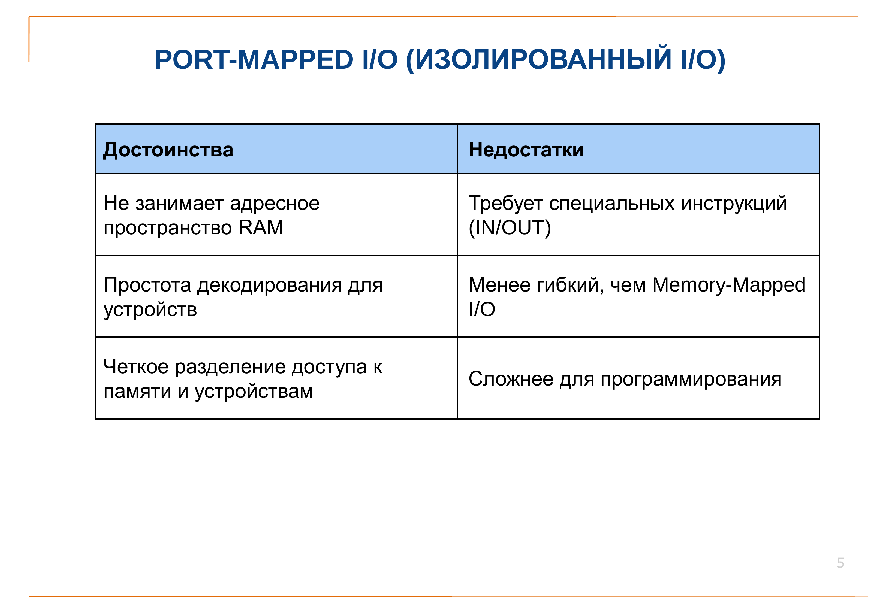
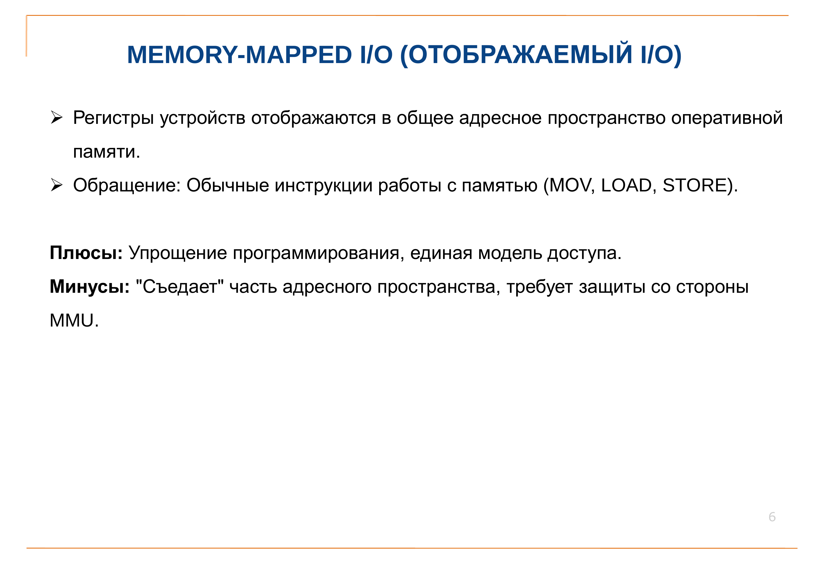
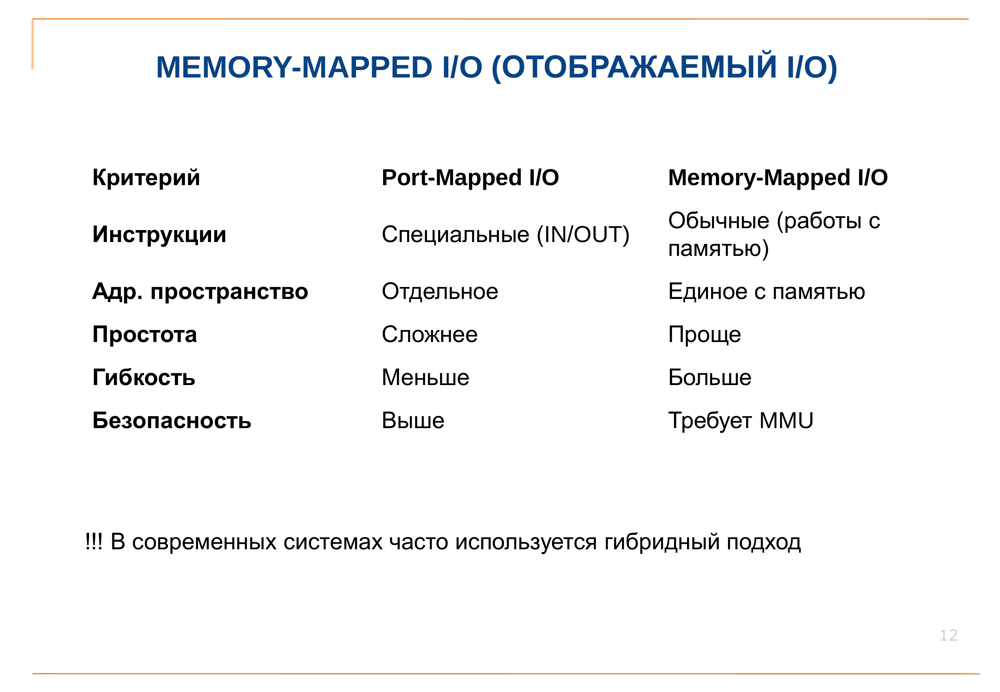

# Ответы на вопросы по СПО

## 1. Регистры общего назначения

Регистры общего назначения в архитектуре x86:

---

## 2. Боксинг сетевых пакетов

Процесс инкапсуляции (боксинга) сетевых пакетов по модели OSI:

---

## 3. PORT-MAPPED I/O и Memory Mapped I/O

Сравнение двух подходов к работе с периферийными устройствами:

Дополнительные материалы:

